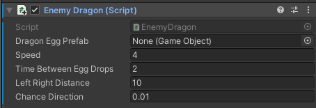
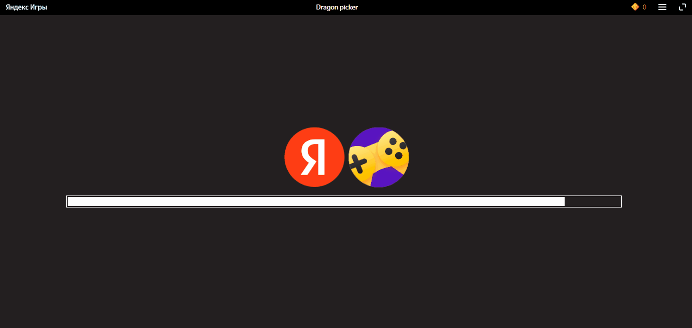

# РАЗРАБОТКА ИГРОВЫХ СЕРВИСОВ
Отчет по лабораторной работе #2 выполнил:
- Назаров Лев Сергеевич
- РИ300012

Отметка о выполнении заданий (заполняется студентом):

| Задание | Выполнение | Баллы |
| ------ | ------ | ------ |
| Задание 1 | * | 60 |
| Задание 2 | * | 20 |
| Задание 3 | # | 20 |

знак "*" - задание выполнено; знак "#" - задание не выполнено;

Работу проверили:
- к.т.н., доцент Денисов Д.В.
- к.э.н., доцент Панов М.А.
- ст. преп., Фадеев В.О.

## Цель работы
Создание интерактивного приложения и изучение принципов интеграции в него игровых сервисов.

## Задание 1
### По теме видео практических работ 1-5 повторить реализацию игры на Unity. Привести описание выполненных действий
Ход работы:
#### Работа 1
1) Создать проект 3D core.
2) Взять ассет дракона из ассет стора и добавить на сцену.

3) Взять из того же ассета анимацию, создать контроллер с ней и добавить его дракону на сцене.

4) Создать шар, удлиненный по Y и имеющий Rigidbody, и сохранить его как префаб Egg. 
5) Создать и настроить материал для яица.

6) Создать энергитический щит, сделать для него материал и сохранить его как префаб EnergyShield.

#### Работа 2
1) Настроить позицию камеры.
2) Создать скрипт для дракона:
```cs
public class EnemyDragon : MonoBehaviour
{
    public GameObject DragonEggPrefab;
    public float Speed = 1;
    public float TimeBetweenEggDrops = 1;
    public float LeftRightDistance = 10;
    public float ChanceDirection = 0.1f;
    void Update()
    {
        var pos = transform.position;
        pos.x += Speed * Time.deltaTime;
        transform.position = pos;

        if (pos.x < -LeftRightDistance || pos.x > LeftRightDistance)
        {
            Speed *= -1;
        }
    }

    private void FixedUpdate()
    {
        if (Random.value < ChanceDirection)
        {
            Speed *= -1;
        }
    }
}
```
3) Настроить скрипт дракона:

#### Работа 3
1) Добавить в скрипт дракона:
```cs
void Start()
{
    Invoke("DropEgg", 2);
}
void DropEgg()
{
    var egg = Instantiate(DragonEggPrefab);
    egg.transform.position = transform.position + new Vector3(0, 5, 0);
    Invoke("DropEgg", TimeBetweenEggDrops);
}
```
2) Добавить префаб Egg в параметр DragonEggPrefab в редакторе.
3) Создать плоскость Plane, растянуть и добавить текстуру из ассет пака с драконом.

#### Работа 4
1) Взять из ассет стора ассет взрыва.
2) Создать скрипт для яица:
```cs
public class DragonEgg : MonoBehaviour
{
    public static float BottomY = -30;
    void Update()
    {
        if (transform.position.y < BottomY)
        {
            Destroy(gameObject);
        }
    }

    private void OnTriggerEnter(Collider other)
    {
        var ps = GetComponent<ParticleSystem>();
        var em = ps.emission;
        em.enabled = true;
        var rend = GetComponent<Renderer>();
        rend.enabled = false;
    }
}
```
3) Добавить и настроить яицу ParticleSystem:

4) Добавить материал из ассет пака взрывов и эффектов в ParticleSystem.

5) Создать, добавить к камере и настроить скрипт:
```cs
public class DragonPicker : MonoBehaviour
{
    public GameObject EnergyShieldPrefab;
    public int EnergyShieldAmount = 3;
    public float EnegyShieldBottomY = -6;
    public float EnegyShieldRadius = 1.5f;
    void Start()
    {
        for (var i = 1; i <= EnergyShieldAmount; i++)
        {
            var tShieldGo = Instantiate(EnergyShieldPrefab);
            tShieldGo.transform.position = new Vector3(0, EnegyShieldBottomY, 0);
            tShieldGo.transform.localScale = new Vector3(1 * i, 1 * i, 1 * i);
        }
    }
}
```

## Задание 2
### В проект, выполненный в предыдущем задании, добавить систему проверки того, что SDK подключен (доступен в режиме онлайн и отвечает на запросы)
Ход работы:
1) Добавить плагин PluginYG.
2) Создать объект YandexGame.
3) Добавить код в скрипт DragonPicker:
```cs
public class DragonPicker : MonoBehaviour
{
    [SerializeField] private TextMeshProUGUI TestText;
    [SerializeField] private UnityEvent authorizationCheck;

    public void ResolvedAuthorization()
    {
        TestText.text = $"SDK подключен. Игрок : \"{YandexGame.playerName}\"";
    }

    public void RejectedAuthorization()
    {
        TestText.text = $"SDK подключен. Авторизация провалена";
    }

    private void OnEnable() => YandexGame.GetDataEvent += SdkDataReceived;

    private void OnDisable() => YandexGame.GetDataEvent -= SdkDataReceived;

    private void SdkDataReceived()
    {
        if (YandexGame.SDKEnabled && FirstLaunch)
        {
            TestText.text = $"SDK подключен. Авторизация...";
            authorizationCheck?.Invoke();
            FirstLaunch = false;
        }
    }
}
```
4) В редакторе подключить ивенты объекта YandexGame к соответствующим функциям в DragonPicker.
5) Настроить DragonPicker в редакторе:

6) Забилдить под WebGL, залить на яндекс игры и проверить работу:

## Выводы

Узнал как адаптировать игру на unity для яндекс игр и как интегрировать их сервисы.

## Powered by

**BigDigital Team: Denisov | Fadeev | Panov**